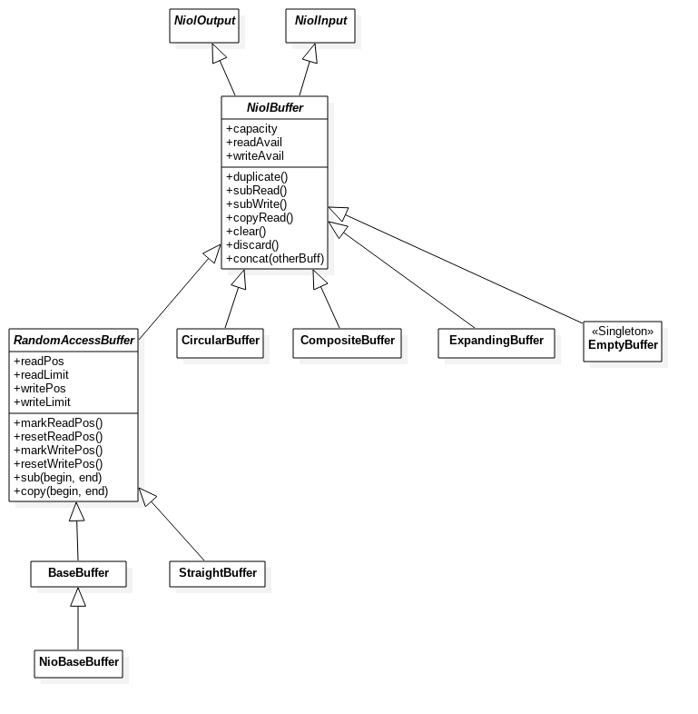

# Niol

[](https://jitpack.io/#TheElectronWill/Niol)


Niol is a NIO Library written in Scala and designed to make server programming easier.

## Abstract Inputs/Outputs

The two traits NiolInput and NiolOutput represent something that can receive/give data. They provide convenient operations like `writeVarint` and `writeString`, and shortcuts like `>>:(Array[Byte])`.

NiolInput example:
```scala
val in: NiolInput = ... // some input
val n = in.getVarint()
val bytes = new Array[Byte](100)
bytes <<: in // equivalent to in.getBytes(bytes)
```
NiolOutput example:
```scala
val out: NiolOutput = ... // some output
true >>: out // equivalent to out.putBoolean(true)
("string", UTF_8) >>: out // equivalent to out.putString("string", UTF_8)
bytes >>: out // equivalent to out.putBytes(bytes)
```
Any input can be directly written to an output:
```scala
in >>: out // equivalent to out.putBytes(in)
```

## Channels

Niol uses the standard Java NIO channels `ScatteringByteChannel` and `GatheringByteChannel`. They can be used with any NiolInput/Output.
```scala
scatteringChannel >>: out
gatheringChannel <<: in
```

You can create `ChannelInputs` and `ChannelOutputs` from files or from any channel:
```scala
val fileOut = new ChannelOutput(nioFilePath)
val fileIn = new ChannelInput(nioFilePath)

val channelOut = new ChannelOutput(scatteringChannel)
val channelIn = new ChannelInput(gatheringChannel)
```

## Buffers

Buffers are the core of Niol. A buffer is a data container that inherits from both NiolOutput and NiolInput.


Read and write operations are separated from each other, that is, two different position indexes are used.

### NiolBuffer vs RandomAccessBuffer

`NiolBuffer` is the superclass of all buffers. It exposes basic reading and writing methods, but hides the read and write positions. The benefit is that "special" buffers can be created, that doesn't have a linear storage, like the `CircularBufer`.

On the contrary, a `RandomAccessBuffer` is a simpler, linear data container, very similar to a java `ByteBuffer` but with two positions instead of one.

### NioBaseBuffer - Like ByteBuffer, but better

As the name suggests, the `NioBaseBuffer` is based on the Java NIO `ByteBuffer` and serves as a base for the other buffers. It is a simple wrapper that adds no special functionality.

The underlying `ByteBuffer` can be either direct or non-direct (see [the ByteBuffer documentation](https://docs.oracle.com/javase/8/docs/api/java/nio/ByteBuffer.html)).

### Buffer Providers

A `NiolBaseBuffer` cannot be created with a constructor. You have to use a `BufferProvider`, for instance the `DefaultOffHeapProvider` :
```scala
val buff: BaseBuffer = BufferProvider.DefaultOffHeapProvider.getBuffer(capacity)
```

Niol also provides a `StageBufferPool`, which is organized in capacity intervals.

```scala
val builder = new StageBufferPoolBuilder()
builder += (100, 250) // keep up to 250 buffers of capacity 100
builder += (1000, 10) // keep up to 10 buffers of capacity 1000
builder.defaultHandler(HeapNioAllocator.getBuffer) // above 1000, allocate on-demand on the heap
val pool = builder.build()
val smalBuffer = pool.getBuffer(75) // 75 <= 100 so this returns a buffer of capacity 100
val bigBuffer = pool.getBuffer(101) // returns a buffer of capacity 1000
val hugeBuffer = pool.getBuffer(2048) // returns a buffer of capacity 2048
```

### Memory Management

To make the provider system work and to release the direct buffers more efficiently, you have to call the `discard()` method when you don't need a buffer anymore.

A discarded buffer must **never** be used. Calling a method on a discarded buffer may or may not work, Niol provides no guarantee at all.

Some operations like `duplicate()` and `sub()` create buffers that are linked to the original buffer. The original buffer won't be collected until all its sub buffers plus itself are discarded.

```scala
val buff = DirectNioAllocator.getBuffer(4096)
val dup = buff.duplicate
// work
buff.discard() // discard the original - this can be done before or after discarding the duplicate, it doesn't matter!
dup.discard() // discard the duplicate -> triggers memory cleanup (see below)
// Both the original and the duplicate have been discarded, therefore the buffer's memory is released as soon as possible.
```

## Non-blocking TCP Server on multiple ports

The `ScalableSelector` allows you to quickly create a TCP server that handles multiple ports and clients simultaneously.

### Usage

The class `ScalableSelector` uses the Java NIO Selector and ServerSocketChannels.
First, create a selector with its basic handlers:
```scala
val errorHandler = (e: Exception) => {
// Reacts to an exception. You can decide to throw an exception to stop the server, or to continue.
}
val startHandler = () => {
// Called when the selector is started
}
val stopHandler = () => {
// Called when the selector is stopped
}
val selector = new ScalableSelector(errorHandler, startHandler, stopHandler)
```

Get a `BufferProvider` that will create one message buffer per client. Here we'll use a `StageBufferPool` to avoid creating a new buffer each time we receive a packet.
```scala
val poolBuilder = new StageBufferPoolBuilder
poolBuilder += (100, 100, DirectNioAllocator.getBuffer)
poolBuilder += (5000, 100, DirectNioAllocator.getBuffer)
val bufferPool = poolBuilder.build()
```

Then, create a subclass of `ClientAttach` to handle the server's clients. Each client has its instance of `ClientAttach`, which contains the client's informations and handles the incoming and outgoing messages.
```scala
final class MyAttach[A](val s: ServerChannelInfos[A], val i: A, val c: SocketChannel) extends ClientAttach[A](s,i,c) {
	override def readHeader(buffer: NiolBuffer): Int = {
      // Parses the message's header
      // Returns the message's size
	}
	override def handleData(buffer: NiolBuffer): Unit = {
      // Parses the message's data.
	}
}
```
The type parameter `A` defines the additional informations carried by the `ClientAttach`, for instance a client ID.

Finally, listen on the port you want by registering a `TcpListener` to the `ScalableSelector`.
```scala
selector.listen(port, 3000, bufferPool, new TcpListener[A] {
	override def onAccept(clientChannel: SocketChannel, serverInfos: ServerChannelInfos[Int]): ClientAttach[Int] = {
		// Creates a new ClientAttach for the newly connected client
		new MyAttach(serverInfos, clientChannel)
	}

	override def onDisconnect(clientAttach: ClientAttach[Int]): Unit = {
		// Called when a client disconnects
	}
})
```

### Sending messages to clients
To send a message to the client, put it (the header + the data) in a buffer and call the `ClientAttach.write` method. You can add a `completionHandler` (in the form of a `Runnable`) that will be executed once the write operation is completed.

```scala
client.write(buffer) // Without completion handler
client.write(buffer, () => {
  // Reacts to the completion of the write operation
})
```

The `write` methods are thread-safe and may be called from any thread.

### Features

- Only one thread for all the connections, with the NIO `Selector`.
- Reacts to events: client accepted, client disconnected, message received, message sent, etc.
- Handles messages' headers and data separately.
- Efficient buffer management that avoids copying the data.
- Robust exception handling.
